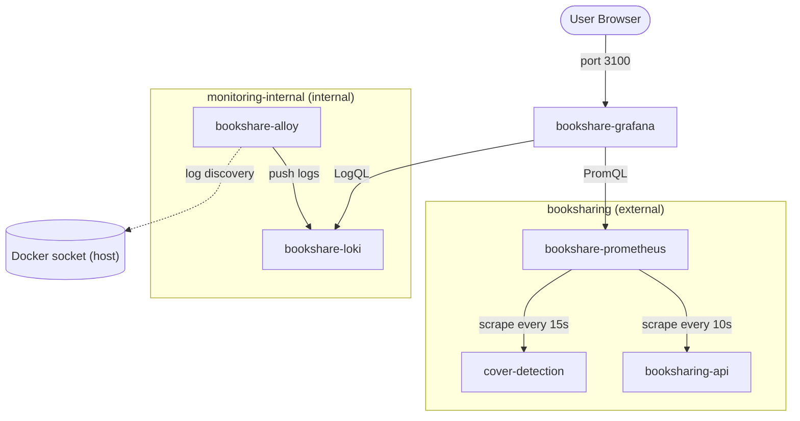

# Network Diagram

## Networks

| Network | Type | Members |
|---|---|---|
| `booksharing` | external (shared) | `booksharing-api`, `cover-detection`, `bookshare-prometheus`, `bookshare-grafana` |
| `monitoring-internal` | internal (no internet routing) | `bookshare-grafana`, `bookshare-loki`, `bookshare-alloy` |

Grafana sits on both networks so it can query Prometheus (over `booksharing`) and Loki (over `monitoring-internal`).

## Host Port Exposure

| Container | Host Binding | Notes |
|---|---|---|
| `bookshare-grafana` | `0.0.0.0:3100` | Accessible externally |
| `bookshare-prometheus` | `127.0.0.1:9090` | Localhost only |
| `bookshare-alloy` | `127.0.0.1:12345` | UI only; not a published Docker port (`--server.http.listen-addr`) |
| `bookshare-loki` | — | No host exposure; reachable only on `monitoring-internal` |

## Log Collection

Alloy collects logs by reading `/var/run/docker.sock` directly (not via any Docker network). It discovers all containers on the host, labels them by container name, and pushes their logs to Loki over `monitoring-internal`. Alloy runs as root because Docker socket access requires it.
